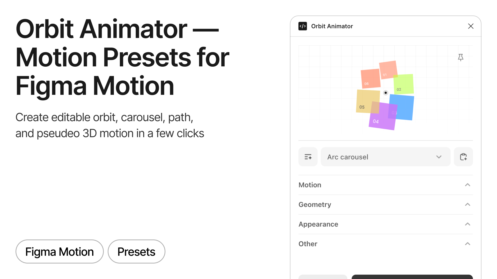

# Orbit Animator

Figma plugin for creating editable orbit, carousel, path, and pseudo-3D animation directly in Figma Motion. Choose a preset, adjust the geometry and appearance, then generate native keyframes in a few clicks.

Orbit Animator is completely free. Everything runs locally — no analytics, no tracking, and no network access.

## Features

- Create editable Figma Motion keyframes from selected layers
- Choose from 20 orbit, path, stack, carousel, and simulated 3D presets
- Fit motion automatically to the selected frame or set the radii manually
- Shape motion with ellipse, custom path, parametric, sphere, deck, tunnel, cylinder, racetrack, fan, pendulum, and vortex geometry
- Control timing, stagger, direction, keyframe density, easing, scale, opacity, rotation, and depth
- Preview the generated animation before applying it
- Save custom presets locally and reuse them later
- Refresh an existing Orbit animation or clear its generated tracks

The pseudo-3D presets use the Motion properties currently available to plugins: X/Y translation, X/Y scale, rotation, and opacity. Depth is simulated with projected paths, scale, opacity, and layer ordering.

## Presets

Circle, Path Wave, Vision Focus, Scatter Orbit, Arc Carousel, 3D Turntable, 3D Vertical Halo, 3D Saturn Tilt, 3D Double Helix, 3D Figure Eight, 3D Sphere, Cover Flow, Stack Shuffle, Tunnel, Cylinder, Racetrack, Fan, Pendulum, Vortex, and Focus Swap.

## Run locally

1. Run `npm install`.
2. Run `npm run build`.
3. In Figma Desktop, open **Plugins → Development → Import plugin from manifest…**.
4. Choose this project's `manifest.json`.
5. Open a Figma Design file, switch to Motion, select layers inside a top-level frame, and run **Orbit Animator**.

The source builds to `dist`, which is intentionally excluded from the repository. Figma Motion and its Plugin API are currently in beta, so API behavior may change.

## Tech Stack

- [React](https://react.dev/) — plugin interface
- [DialKit](https://www.dialkit.dev/) — controls and preset management
- [Motion](https://motion.dev/) — live animation preview
- [TypeScript](https://www.typescriptlang.org/) — application code
- [esbuild](https://esbuild.github.io/) — build tooling

## You can also try

[Color Shuffler — Explore and adjust UI color palettes](https://www.figma.com/community/plugin/1622294161663649835).

## License

This project is licensed under the Creative Commons Attribution-NonCommercial 4.0 International License (CC BY-NC 4.0). See [LICENSE](LICENSE) for the full license text. Third-party runtime licenses are listed in [THIRD_PARTY_NOTICES.md](THIRD_PARTY_NOTICES.md).
